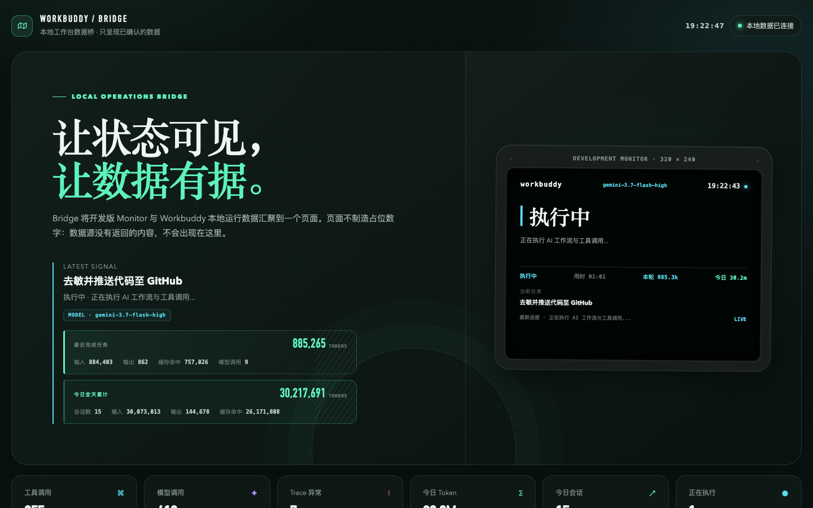

# Workbuddy 桌面硬件状态机 (ESP32-S3 Desktop HUD)

<p align="center">
  
  
  
  <br>
  <b>基于立创·实战派 ESP32-S3 开发板的 AI 桌面物理状态指示器与中继系统</b>
</p>

---

## 🌟 项目简介

**Workbuddy 桌面硬件状态机** 是为 Workbuddy / AI Agent 打造的物理桌面级智能状态提示器（HUD）。通过 USB 串口或本地 HTTP API，将 AI 助手在执行任务时的**实时状态、任务标题、耗时、调用工具次数、Token 消耗以及步骤时间线**毫秒级投射到 2.0 寸 320×240 IPS 屏幕与 Web 聚合看板上。

当 AI Agent 需要人类介入（提问回答 `NEED_ANSWER`、高危操作审批 `NEED_APPROVAL`、异常报错 `ERROR`）时，HUD 会以高亮视觉聚焦提示，并支持通过开发板上的 **BOOT 实体物理按键** 一键确认回传给主机。

<p align="center">
  
</p>

---

## 🚀 核心特性

1. **6 大核心状态全息流转**：
   - 🔵 `RUNNING`（运行中）：动态焦点，实时展示当前执行步骤、运行耗时与工具调用计数。
   - 🟣 `NEED_ANSWER`（需回答）：紫色高亮，提取提问的核心问题摘要。
   - 🟠 `NEED_APPROVAL`（需确认）：琥珀色高亮，提示危险操作，等待物理/软件审批。
   - 🟢 `COMPLETED`（已完成）：绿色常亮，展示任务总用时、Token 消耗与完成步骤。
   - 🔴 `ERROR`（异常报错）：红色警报，快速定位阻断原因。
   - ⚪ `IDLE`（待机就绪）：低功耗静默待机。

2. **双向反向交互 (Hardware-to-Agent)**：
   - 遇到审批流时，按下板载 **BOOT 物理按键**（GPIO 0），开发板自动回传 `{"event":"KEY_PRESS","key":"BOOT","action":"APPROVE"}` 信号。

3. **双缓冲零撕裂渲染**：
   - 基于 ESP32-S3 8MB Octal PSRAM + LovyanGFX 全屏双缓冲引擎与平滑字体抗锯齿渲染。

4. **双模中继与 Web 聚合看板**：
   - **自动感知中继 (Auto-Sensor Live Engine)**：后台常驻守护进程，自动监听工作区会话数据库与 Traces，无需手动打桩即可同步任务动态。
   - **Web 数据看板**：提供 `http://127.0.0.1:5200/bridge` 数据聚合看板与 `/monitor` 网页 HUD 映射。
   - **完成 Token 凭据**：任务完成后按 `sessionId` 匹配真实 Trace，在 HUB 展示本轮总 Token 及输入、输出、缓存命中与模型调用数。
   - **今日 Token 汇总**：聚合当日所有绑定会话的 Agent Trace，独立显示所有会话 Token 总消耗，并排除标题生成等无会话 Trace。

---

## 📐 硬件规格与引脚映射（立创·实战派 ESP32-S3）

| 硬件模块 | 参数 / 芯片 | 引脚映射 / 接口 |
| :--- | :--- | :--- |
| **主控芯片** | ESP32-S3-WROOM-1-N16R8 | 16MB Flash / 8MB Octal PSRAM |
| **显示屏幕** | 2.0 寸 IPS 液晶屏 (ST7789) | 分辨率 320 × 240 (横屏) |
| **屏幕 SPI** | SPI 模式 2 | `MOSI: GPIO 40`, `SCLK: GPIO 41`, `DC: GPIO 39` |
| **屏幕背光** | 硬件低电平点亮 | `Backlight (BL): GPIO 42` |
| **IO 扩展** | PCA9557 (I2C 地址 0x19 / 0x18) | `SDA: GPIO 1`, `SCL: GPIO 2`<br>`IO0: LCD_CS` (低有效片选) |
| **物理按键** | 硬件一键 Approve 确认 | `BOOT: GPIO 0` (低电平触发) |

---

## 🏗️ 系统架构

```text
┌──────────────────────────────────────────────────────────┐
│                   Workbuddy PC 端环境                     │
│  ~/.workbuddy-ai/workbuddy.db & Traces 实时感知           │
└────────────────────────────┬─────────────────────────────┘
                             │
                             ▼
┌──────────────────────────────────────────────────────────┐
│            host_bridge / 电脑端中继守护进程 (Python)        │
│  - daemon.py: 自动会话感知、状态监听、Web 5200 端口服务    │
│  - bridge.py / live_bridge.py: USB 串口自动寻址与数据帧推流 │
└──────────────┬────────────────────────────┬──────────────┘
               │ (HTTP API / JSON)          │ (USB-CDC / 115200 bps)
               ▼                            ▼
┌──────────────────────────────┐ ┌─────────────────────────┐
│     Web Dashboard / HUD      │ │  立创 ESP32-S3 开发板    │
│   http://127.0.0.1:5200/     │ │  (firmware / ST7789)    │
│   - /bridge (数据看板)       │ │  - PSRAM 320x240 双缓冲 │
│   - /monitor (HUD 同步映射)  │ │  - 实体按键 Approve 回传│
└──────────────────────────────┘ └─────────────────────────┘
```

---

## 📦 项目目录结构

```text
.
├── firmware/                  # ESP32-S3 固件工程 (PlatformIO)
│   ├── platformio.ini         # 编译与依赖配置 (LovyanGFX + ArduinoJson)
│   └── src/
│       ├── bsp_board.h/cpp    # 立创实战派硬件驱动 (PCA9557 / LCD_CS / 背光)
│       ├── display_hud.h/cpp  # 320x240 HUD 渲染引擎
│       └── main.cpp           # 串口协议解析与状态机主循环
├── host_bridge/               # 电脑端中继与测试套件 (Python)
│   ├── daemon.py              # 全自动感知守护进程 & Web API 服务
│   ├── bridge.py              # 串口自动发现与状态机仿真推流
│   ├── live_bridge.py         # 实时会话桥接推流
│   ├── send_status.py         # 单帧状态测试发送工具
│   ├── terminal_hud.py        # 终端纯文本 HUD 监控
│   ├── test_suite.py          # 接口契约与并发压力测试套件
│   └── requirements.txt       # Python 依赖清单
├── bridge_dashboard.html      # Web 数据看板前端
├── web_hud.html               # Web HUD 映射页面
├── start_daemon.sh            # 后台守护进程一键启动脚本
├── stop_daemon.sh             # 停止守护进程脚本
├── run_hud.command            # 快捷启动终端 HUD (macOS)
├── run_live_hud.command       # 快捷启动实时推流 (macOS)
├── PROJECT_RECORD.md          # 详细开发档案与踩坑记录
└── README.md                  # 项目说明文档
```

---

## 🔌 状态机通信协议 (JSON 帧格式)

电脑端与 ESP32-S3 之间通过标准串口每秒推流 JSON 帧，格式如下：

```json
{
  "state": "RUNNING",
  "thread": "Thread #01 · vibe-coding",
  "time": "18:35:00",
  "alert_title": "正在重构状态机核心总线",
  "alert_desc": "Task: 执行代码修改与单元测试",
  "step": "2/5",
  "tools": "8 次",
  "duration": "01:20",
  "tokens": "12.3k",
  "model": "gemini-3.7-flash-high",
  "timeline": [
    {"text": "分析项目代码架构", "dur": "0.6s", "done": true, "active": false},
    {"text": "编写状态监听模块", "dur": "1.2s", "done": true, "active": false},
    {"text": "重构状态机核心总线", "dur": "进行中", "done": false, "active": true}
  ]
}
```

### 字段说明

- `state` (string, 必需)：状态枚举：`IDLE` | `RUNNING` | `NEED_ANSWER` | `NEED_APPROVAL` | `COMPLETED` | `ERROR`。
- `thread` (string)：当前线程/会话名称。
- `time` (string)：时钟时间。
- `alert_title` (string)：主标题 / 任务名称。
- `alert_desc` (string)：任务详情 / 提问与审批描述。
- `step` (string)：当前进度（如 `2/5`）。
- `tools` (string)：工具调用次数（如 `8 次`）。
- `duration` (string)：运行时长（如 `01:20`）。
- `tokens` (string)：消耗 Token 数（如 `12.3k`）。
- `model` (string, 可选)：当前 AI 模型名称。
- `timeline` (array)：步骤列表（包含 `text`、`dur`、`done`、`active`）。

---

## 🛠️ 快速开始

### 1. 固件烧录 (ESP32-S3)

1. 在 **VS Code** 中安装 **PlatformIO IDE** 插件。
2. 用 **Type-C 数据线** 将立创·实战派 ESP32-S3 开发板连接到电脑。
3. 打开 `firmware` 文件夹。
4. 点击 PlatformIO 的 **`Upload` (上传烧录)**，工具链将自动拉取依赖库并完成固件编译烧录。
5. 屏幕点亮并显示待机初始状态：`WORKBUDDY · DESKTOP HUD`。

### 2. 电脑端中继环境准备

```bash
# 安装 Python 依赖
pip install -r host_bridge/requirements.txt
```

### 3. 一键启动守护进程

```bash
# 启动后台常驻守护进程 (自动脱离终端)
./start_daemon.sh

# 停止守护进程
./stop_daemon.sh
```

### 4. 访问 Web 看板与 Monitor

守护进程启动后，打开浏览器访问：
- **Bridge 聚合数据看板**：`http://127.0.0.1:5200/bridge`
- **Web HUD 实时映射**：`http://127.0.0.1:5200/monitor`
- **实时状态 API**：`http://127.0.0.1:5200/api/status`
- **聚合数据 API**：`http://127.0.0.1:5200/api/bridge`

> 开发时也可以直接打开 `bridge_dashboard.html`。页面在 `file://` 模式下会自动连接 `http://127.0.0.1:5200/api/bridge`；正式 HTTP 入口仍使用同源 `/api/bridge`。

---

## 🧪 测试与仿真工具

- **多状态演练仿真**：
  ```bash
  python3 host_bridge/bridge.py
  ```
- **单帧状态发送调试**：
  ```bash
  python3 host_bridge/send_status.py --state NEED_APPROVAL --title "请求写入配置文件" --desc "platformio.ini"
  ```
- **自动化测试套件 (API 契约、CORS、并发压力)**：
  ```bash
  python3 host_bridge/test_suite.py
  ```

---

## 📄 开源许可证

本项目基于 [MIT License](LICENSE) 开源。
